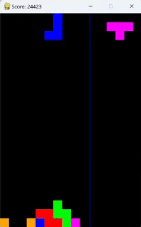

# Tetris AI
<br>
This is a Tetris AI that uses weighted features to determine the best move to make. 
Weights learning refers to [PSO](https://karrui.dev/docs/ai-tetris-report.pdf). 

## How to run
1. Clone the repository.
2. Create a conda environment using the `environment.yml` file.
```bash
    conda env create --file environment.yml
```
3. Activate the environment.
```bash
    conda activate tetris
```
4. Run the main file.
```bash
    python visual-pygame.py
```
